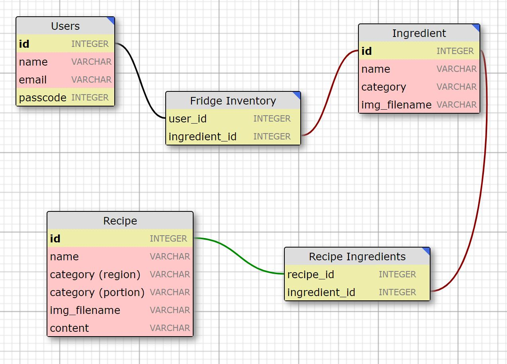

# Recipe Recommender 🍴
Cross-platform mobile fridge manager and recipe recommender based on Flutter and Python.

## Backend

### Database (SQLite) 💾

1. [Database design](https://ondras.zarovi.cz/sql/demo/)

### Flask Setup 🌶️

1. [Codementor's Flask guide](https://www.codementor.io/@dongido/how-to-build-restful-apis-with-python-and-flask-fh5x7zjrx)
2. [Grinberg's Flask guide (Crash Course)](https://blog.miguelgrinberg.com/post/designing-a-restful-api-with-python-and-flask?fbclid=IwAR10kkkJNCcgVAIHkaDZKdXq3yL1lP8kGykt3466kT61olZmhvz6wjoBiNY)
3. [Grinberg's Flask guide (Mega Tutorial)](https://blog.miguelgrinberg.com/post/the-flask-mega-tutorial-part-i-hello-world)

Resources will use HTTP methods as follows:

| HTTP Method | URI                                                               | Action                                                  |
|-------------|-------------------------------------------------------------------|---------------------------------------------------------|
| GET         | http://[hostname]/recommender/users/[user_id]                     | Retrieve a user                                         |
| POST        | http://[hostname]/recommender/users                               | Create a new user                                       |
| PUT         | http://[hostname]/recommender/users/[user_id]                     | Update user information                                 |
| DELETE      | http://[hostname]/recommender/users/[user_id]                     | Delete an existing user                                 |
|             |                                                                   |                                                         |
| GET         | http://[hostname]/recommender/ingredients/[ingredient_id]         | Retrieve an ingredient                                  |
| GET         | http://[hostname]/recommender/ingredients/search_key/[search_key] | Retrieve list of ingredients that begin with search key |
| GET         | http://[hostname]/recommender/ingredients/user_id/[user_id]       | Retrieve list of ingredients that the user has          |
| PUT         | http://[hostname]/recommender/ingredients/user_id/[user_id]       | Update list of ingredients that the user has            |
|             |                                                                   |                                                         |
| GET         | http://[hostname]/recommender/recipes/[recipe_id]                 | Retrieve a recipe                                       |
| GET         | http://[hostname]/recommender/recipes/search_key/[search_key]     | Retrieve list of recipes that begin with search key     |
| GET         | http://[hostname]/recommender/recipes/user_id/[user_id]           | Retrieve list of recipes that the user can make         |

### Sample Recipes

## Frontend

### Flutter

## Miscellaneous

### Web Scraping
