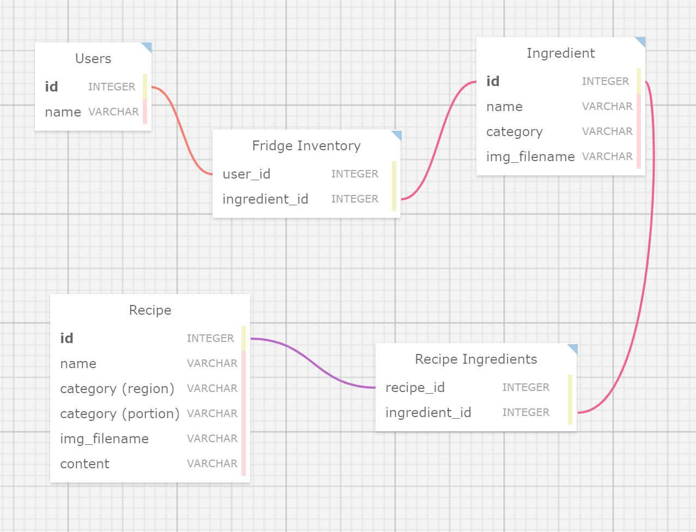

# Recipe Recommender 🍊
Cross-platform mobile fridge manager and recipe recommender based on Flutter and Python.

## Backend

### Database (SQLite)

1. [Database design](https://ondras.zarovi.cz/sql/demo/)

### Flask Setup

1. [Setting up Flask RESTful API with PostgresQL](https://www.codementor.io/@dongido/how-to-build-restful-apis-with-python-and-flask-fh5x7zjrx)

## Frontend

### Flutter

## Miscellaneous

### Web Scraping
